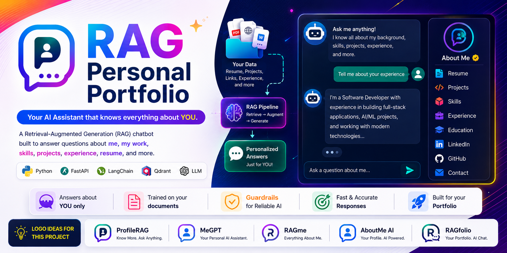

# RAG: Personal Portfolio



## Overview:

RAG stands for Retrieval Augumented Generation. 
- Retrieve only the useful data from the huge chunk of data.
- Use the Retrieve chunk and modify the data as per the use fo the question asked.
- Very exonomix option for integrating AI in any of our existed product or solutions.

This is a **Personal Portfolio** project which answers only for the Data ingested during the time of Ingestion.  I have used this porject as the of my Personal Portfolio.

## Motivation:

The Motivaiton of making this project is that the personal portfolio are very similar type that everything is website based project. So, **RAG: Portfolio * is a use of Agentic AI at very base level and made a Chatbot which only talk about my details and facts I will provide in data points. 

✨ You can use this project with some minor tweeks and can check the commit history so you will get the idea the data i have build this on.

## Tech Stack:

- **Language:           Python 3.11**
- **Library/Framework:  FastAPI, LangGraph**
- **Vector Database:    Qdrant**
- **LLM:                openai-gpt-oss-20b (OpenAI)**
- **Embedding Model:    gemini-embeddings-v2 (Google), all-mpnet-base-v2 (Sentence Transformers)**
- **Observability:      Pydantic Logfire**
- **Guardrails:         NeMo Guardrails (Input, Output, Topic, JailBreak)**

## File/Folder Structure:
```text
rag
|
|- .venv/               # virtual environment
|- app/                 # main application
|- DATA/                # raw data in any format or file type
|- processed_data/      # Local Copy of processed and chunked data stored in vector DB
|- .env                 # API keys and tokens
|- .gitignore           
|- README.md
|- requirements.txt     # libraries and packages used during the project
```

## Data Flow Diagram (DFDs)


<div align=center> User Flow </div>

## Local Setup:

1. Clone the Repository:
```bash
git clone https://github.com/hariom2809/rag.git
```

2. Get your API keys and tokens from the Gemini, Groq and Qdrant Cloud
```.env
# Grow APIs 
GROQ_API_KEY=your_groq_api_key
GROQ_FALLBACK_API_KEY=your_groq_fallback_api_key
GROQ_MODEL=openai/gpt-oss-20b

# Qdrant APIs
QDRANT_API_KEY=your_qdrant_api_key
QDRANT_CLUSTER_ENDPOINT=your_cluster_endpoint

# Gemini APIs
GEMINI_API_KEY=your_api_key
```
Look inot the .env.example there you will have all environment variable

3. Make Virtual Environment
    - For this project I am using the UV Python package manager you can do the same with cPython
```bash
uv venv --python 3.11
```
For this we are using the runtime of 3.11 .  Can Verify from the [runtime](runtime.txt)

4. Activate the Virtual Environment
    - Windows
    ```bash 
    source .venv/Scripts/activate
    ```
    - Linux/MacOS
    ```bash
    source .venv/bin/activate
    ```

5. Now collect all of your documents and Data to be ingested in db and place it at the DATA folder under a subfolder by any name. Suppose we gave ti name raw_data ->  DATA/raw_data/....
6. Go the Config file in the app folder app/config.py and change the name of your Qdrant collecion as of your choice
7. Run the Ingestion Process
```bash
python -m app.ingestion.processor DATA/{your_folder_name} {your_destination_folder_name}
```
The Data for the Local instance will got save at the processed_data directory 

8. You are all set now run the server
```bash
uvicorn app.main:app --reload --port 8000
```

Now you can test your application on Engpoint
```https
http://localhosta;8000/docs
```

## Author

**Hariom Gupta**
Email: hariomgupta2809@gmail.com
Linkedin: [linkedin/hariom2809](https://www.linkedin.com/in/hariom2809)