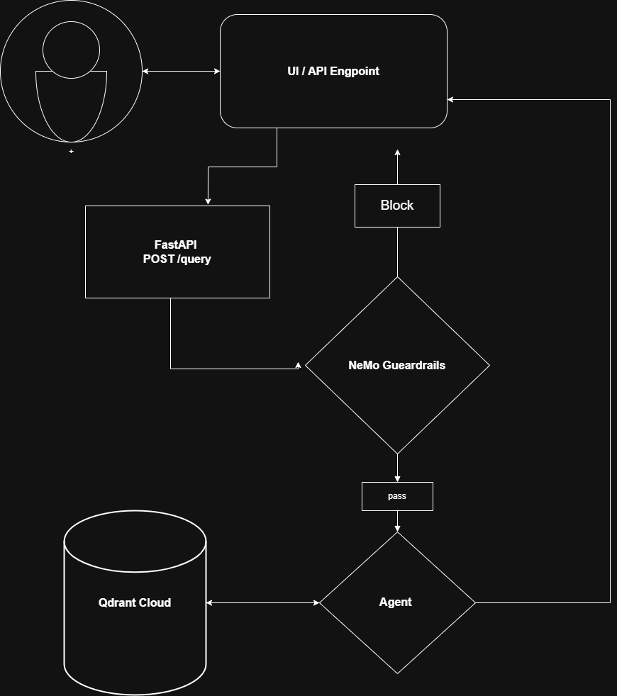

<p align="center">
  
  <span style="font-size: 32px; font-weight: bold;">Application Flow</span>
</p>




- User Enter the query and message they want to ask about the **DATA** we have ingested in our **Vector Store**.

- We receive the query form the user through endpoint **POST /query**
```json
{
    "q": "string",
    "thread_id": "thread_id"
}
```

- After receiving the query form the user we pass that query to our **FastAPI** backend.

- Query goes to our **Guardrail** there we will specify whether the query is safe to process or not.  It can be manupulative query like **JailBreak Attempt, Prompt Ingestion, Token Exhaustion Attack and Repeatative Questiona**.

- Out [Guardrails](./guradrails/README.md) perform the Analysis over the entered prompt and classify whether the query is worth processing or not. 

    - If **Block** we return a simple response that we are not able to process this and the suitable message as per the query.

    - If **Pass** then the query will proceed to the [Agent Processing](./agents/README.md).

- Agent Decides what to do with the query. Is that is a **CONVERSATIONAL or TECHNICAL** query.

- Agent Provide a suitable response for our asked query and we get our **Response**.