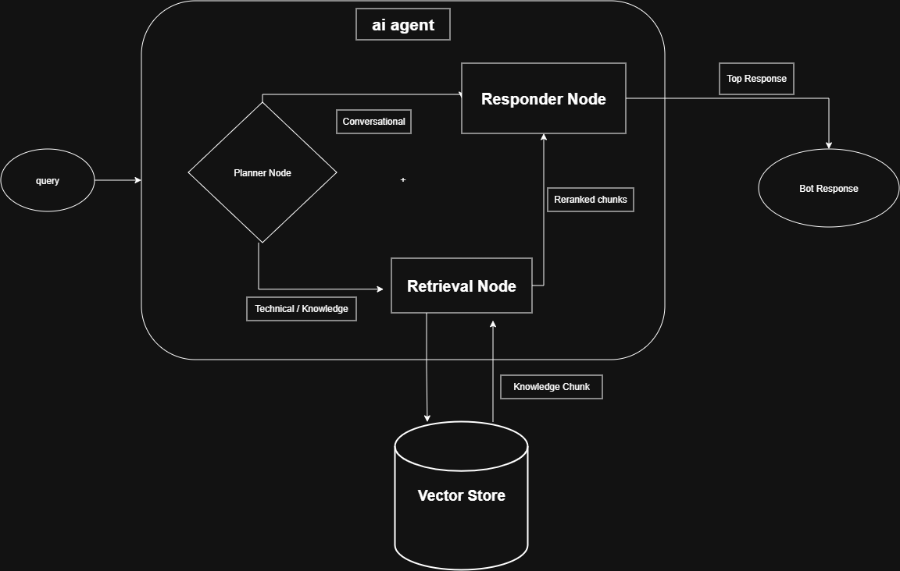

  
  AI Agent Workflow

- Query enter the backend service and then pass to the **Agent**.

- First the query goes to the **Planner Node**. Planner node decides the intent of the query either Conversational or Technical.

    - If the Intent is Conversatinal then the response generated from teh the Chat history.

    - If the Intent is Technical then the query goes to the **Retrieval Node**.

- **Retrieval Node** After the planner node processed tothe retrieval node fetches the vector chunk form the Vector Store top 15 candidate

- **Responder Node** has two responsibility. If the query came direct form Planner Node then it will directly answer the query otherwise It will take the answer from the Retrieval Node.

- After the alll of the processing the Agent reply with the suitable response.
