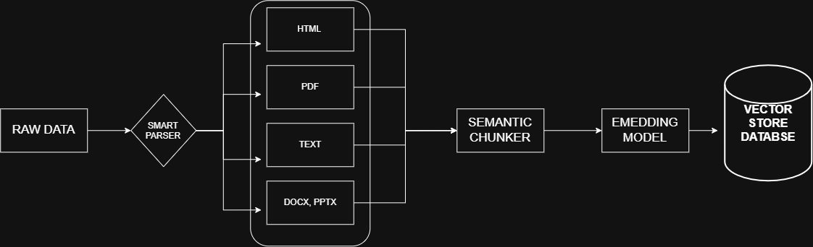

-

  
  Ingestion Pipeline

- Raw data was stored in DATA folder

- Data passes to the Smart Parser then it will go through the Loaders

- Loaders have multiple functions running for different file type. HTML, TEXT, PDF and OFFICE.

- Then the respeted files goes to the Smart Chunker.

- Embedding has been applied to the chunks made by the Smart Chunker.

- After the Embeddings has generated then the data got saved in Vector store.